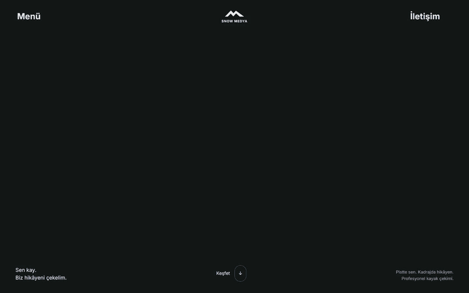
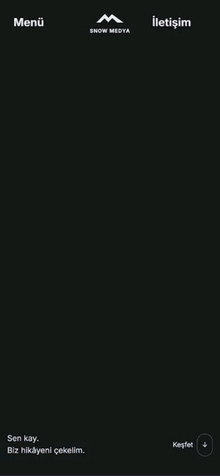

<p align="center">
  
</p>

<h1 align="center">Snow Medya</h1>

<p align="center">
  <strong>Sen kay. Anın film olsun.</strong><br />
  Kişisel kayak deneyimini sinematik bir hikâyeye dönüştüren portföy projesi.
</p>

<p align="center">
  <a href="https://snow-medya.furkan-akpinar.workers.dev/"><strong>Canlı siteyi ziyaret et ↗</strong></a>
</p>

<p align="center">
  
  
  
  
</p>

<p align="center">
  <a href="#konsept">Konsept</a> ·
  <a href="#ekran-goruntuleri">Intro önizlemeleri</a> ·
  <a href="#ozellikler">Öne çıkanlar</a> ·
  <a href="#teknoloji">Teknoloji</a> ·
  <a href="#kurulum">Kurulum</a> ·
  <a href="#kontroller">Kontroller</a>
</p>

---

<a id="konsept"></a>

## Konsept

Snow Medya, kayak tutkunlarının pistte geçirdikleri anları profesyonel bir çekim ekibiyle sinematik ve etkileyici videolara dönüştürmek üzerine kurulu bir portföy projesidir. Çekim planından pistte çekime, kurgudan renge uzanan yaklaşımı; büyük tipografi, kış sporları görüntüleri ve hareketli bir anlatımla sunar.

Film seçkisindeki dört çalışma **konsept sunumlarıdır**; tamamlanmış müşteri işleri değildir. İletişim sayfası bilgilendirme amaçlıdır; çalışan bir mesaj gönderim altyapısı veya rezervasyon sistemi içermez.

<a id="ekran-goruntuleri"></a>

## Intro önizlemeleri

Çalışan yerel üretim çıktısından alınan yaklaşık sekiz saniyelik ekran kayıtlarının GIF önizlemeleri. Kayıt sırasında masaüstünde **1440×900**, mobilde **390×844** CSS viewport kullanılmıştır. Giriş yazıları, videonun büyümesi ve manifesto başlığının yükselişi otomatik olarak döngüde oynar.

<p align="center">
  
</p>

<p align="center">
  
</p>

<a id="ozellikler"></a>

## Öne çıkanlar

- **Kesintisiz açılış:** perspektifli giriş yazıları, aynı video alanının büyümesi ve manifesto harflerinin yükselişi tek otomatik sekans oluşturur. Sonrasında normal kaydırma devam eder.
- **Güçlü görsel dil:** koyu zemin, turkuaz vurgular, açık manifesto alanı ve büyük Barlow Condensed başlıklar.
- **Tam ekran menü:** 01–04 numaralı Filmler, Çekimler, Ekibimiz ve İletişim bağlantıları; seçimde ve Escape ile kapanma.
- **Hareketli seçki:** dört konseptin detay sayfaları, videolu proje kartları, sıradaki projeye geçiş ve açılır çekim aşamaları.
- **Ekrana uygun medya:** yerel masaüstü/mobil video sürümleri, poster desteği ve görünürlüğe göre oynatma. Arka plan videoları sessiz ve döngülüdür.
- **Hareket azaltma desteği:** otomatik intro ve arka plan videoları yerine okunabilir son yerleşim ve posterler; klavye odağı ve içeriğe geçiş bağlantısı.

<a id="teknoloji"></a>

## Teknoloji

| Katman                   | Kullanılan yapı                                               |
| ------------------------ | ------------------------------------------------------------- |
| Arayüz                   | HTML5, özel CSS, vanilla JavaScript / ES Modules              |
| Derleme ve geliştirme    | Vite 8.2.2                                                    |
| Animasyon                | Yerel GSAP 3.13.0 ve ScrollTrigger                            |
| Kaydırma                 | Yerel Lenis 1.3.1                                             |
| Tipografi                | Yerel Barlow Condensed ve Inter fontları                      |
| Kod biçimi ve kontroller | Prettier 3.9.6, Node.js sözdizimi ve varlık kontrol betikleri |

Paket sürümleri [package.json](package.json) ve [package-lock.json](package-lock.json), yerel kütüphane ve medya kayıtları [provenance.json](public/assets/provenance.json) içinde tutulur. Uygulama hash rotaları kullanır; sunucuda her sayfa için ayrı yönlendirme kuralı gerektirmez.

<a id="kurulum"></a>

## Kurulum

**Node.js 24** önerilir (`.nvmrc`). Desteklenen sürüm aralığı `^22.12.0 || >=24.0.0`; npm gerekir.

```powershell
git clone https://github.com/furkan-akpinar/snow-medya.git
cd snow-medya
npm.cmd ci
npm.cmd run dev
```

Geliştirme sunucusu: `http://127.0.0.1:5173/`. Komutlar Windows PowerShell içindir; diğer ortamlarda `npm.cmd` yerine `npm` kullanılabilir. Port doluysa `npm.cmd run dev -- --port 5174` ile değiştirilebilir.

### Üretim derlemesi ve önizleme

```powershell
npm.cmd run build
npm.cmd run preview
```

Derleme önce `check` komutunu çalıştırır, ardından statik çıktıyı `dist/` içine yazar. Önizleme bu çıktıyı `http://127.0.0.1:4173/` adresinde sunar; kaynak değişikliklerinden sonra yeniden derleme gerekir. [Vite yapılandırmasındaki](vite.config.js) `base: './'` ayarı alt klasörden sunmayı destekler.

<a id="kontroller"></a>

## Kontroller

| Komut                       | Kapsam                                                                                                                      |
| --------------------------- | --------------------------------------------------------------------------------------------------------------------------- |
| `npm.cmd run check`         | Üç uygulama JavaScript dosyasının sözdizimi, gerekli dosyalar ve içerik alanları arasında medya kaynağı tekrarının kontrolü |
| `npm.cmd run format:check`  | Kaynak, yapılandırma ve dokümantasyon dosyalarının Prettier biçimi                                                          |
| `npm.cmd run check:release` | Dosya boyutu sınırı, belirli anahtar kalıpları, medya kaynak kayıtları ve lisans dosyalarının tutarlılığı                   |
| `npm.cmd run build`         | `check` ve Vite üretim derlemesi                                                                                            |

`npm.cmd run format` dosyaları biçimlendirerek değiştirir. Otomatik birim veya uçtan uca tarayıcı test paketi yoktur; bu komutlar görsel ve etkileşimli kontrollerin yerine geçmez. `check:release` kapsamlı bir gizli bilgi tarayıcısı değildir. Mevcut tarayıcı kontrol kayıtları: [genel QA](docs/QA.md), [intro](docs/INTRO.md), [metinler, header ve logo](docs/PERSONAL-SKI.md).

## Proje yapısı

```text
index.html             Header, menü, footer ve ortak sayfa kabuğu
src/main.js            İçerikler, proje seçkisi, rotalar ve animasyonlar
src/ambient-video.js   Arka plan videolarının yüklenmesi ve oynatılması
src/media-catalog.js   Her içerik alanına özel görsel ve video kaynakları
src/styles.css         Yerleşim, tipografi ve responsive kurallar
public/assets/         Videolar, posterler, görseller, fontlar ve kütüphaneler
scripts/               Varlık ve teslim kontrol betikleri
docs/                  Kontrol notları, ekran kayıtları ve görüntüleri
```

**İçerik düzenleme:** proje adları ve açıklamaları `src/main.js` içindeki `projects` dizisinden; sayfa ve çekim metinleri aynı dosyadaki şablonlardan değiştirilir. Ortak menü, header ve footer metinleri `index.html` içindedir. Görsel ve videolar `src/media-catalog.js` üzerinden atanır; 44 içerik alanının her biri farklı bir özgün kaynak kullanır. Bir videonun masaüstü/mobil sürümleri ve posterleri aynı alana aittir. Medya değişiklikleriyle birlikte `public/assets/provenance.json` kaydı da güncellenmelidir.

`node_modules/`, `dist/`, yerel ortam dosyaları ve geçici test kayıtları `.gitignore` ile depo dışında tutulur.

## Medya, fontlar ve lisanslar

Görüntüler üçüncü taraf stok içeriklerdir; Snow Medya tarafından çekildikleri iddia edilmez. Dosya bazında kaynak, üretici, lisans, video boyutu ve düzenleme bilgileri [medya kaynak kaydında](public/assets/provenance.json) bulunur. Bu kayıt, seçkiye eklenen 15 videonun ve 20 fotoğrafın üreticilerini de içerir; Pixabay kaynaklı 854878 ve 257961 numaralı içeriklerin Pexels sayfalarındaki CC0 bilgisi ayrıca korunur.

| Kaynak                  | Mevcut atıflar ve lisans kayıtları                                                                                                                                                                          |
| ----------------------- | ----------------------------------------------------------------------------------------------------------------------------------------------------------------------------------------------------------- |
| Pexels                  | Videolar: Adrien JACTA (intro / 4274798), Ella Wei, Igor Deshkin, Grisha Grishkoff, Be The Observer, Gilmer Diaz Estela (kurgu). Fotoğraf: Mikhail Nilov. [Pexels lisansı](https://www.pexels.com/license/) |
| Unsplash                | Fotoğraflar: Tino Rischawy ve Lorin Both. [Unsplash lisansı](https://unsplash.com/license)                                                                                                                  |
| Fontlar                 | SIL Open Font License 1.1: [Barlow Condensed](public/assets/licenses/Barlow-OFL.txt) · [Inter](public/assets/licenses/Inter-OFL.txt)                                                                        |
| Animasyon kütüphaneleri | [Lenis — MIT](public/assets/licenses/Lenis-MIT.txt) · [GSAP Standard License](https://gsap.com/standard-license); GSAP dosya başlıkları korunur                                                             |

Proje için ayrı bir kök lisans dosyası tanımlanmamıştır. npm bağımlılıklarının lisansları ilgili paketlerde bulunur. Görsel hareket referansı: [Sadu Media](https://www.sadumedia.com/). README ekran kayıtları ve görüntüleri bu uygulamanın kendi arayüzünden alınmıştır.

---

<p align="center">
  <strong>Furkan Akpınar</strong> · <a href="https://github.com/furkan-akpinar">GitHub</a>
</p>
